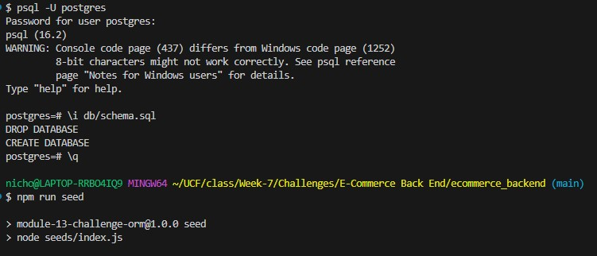
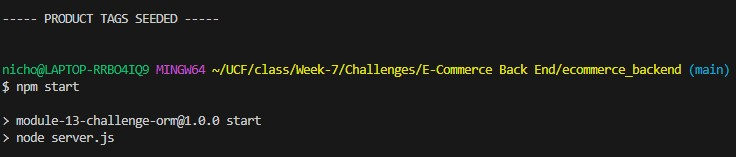
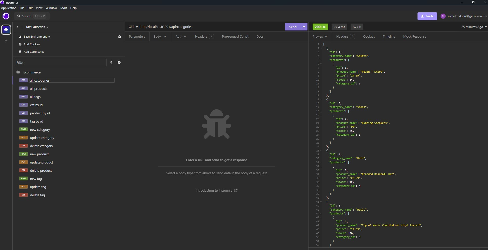

# E-Commerce Backend
  ## Description
  

  This application is the back end for an potential e-commerce site. It utilizes Express.js and Sequelize to interact with a PostgreSQL database. Once the application is running, the user can perform all data management via fetch requests with Insomnia.

  Watch a video demonstration here: https://drive.google.com/file/d/1pqDNyFKzEvob0ianEl4tLYa7N_T42Sv4/view

  ## Table of Contents

  * [Installation](#installation)
  * [Usage](#usage)
  * [Credits](#credits)
  * [License](#license)
  * [Contributing](#contributing)
  * [Tests](#tests)
  * [Questions](#questions)

  ## Installation

  To install, clone repo to user's local files. In the command line, run npm install to install dependencies

  ## Usage

Once repo is in local files, enter Postgres in the command line. Run \i db/schema.sql to create database. Exit Postgres. Run npm run seed to seed database. Run npm start to start application. Use Insomnia to make GET, POST, PUT, and DELETE requests. 

  ## Credits

  I would like to thank my classmates, TAs, and tutors in the UCF Bootcamp for their advice and access to resources. 

  ## License

  
  This project is licensed under the MIT License.

  [License: MIT](https://opensource.org/licenses/MIT)

  ## Contributing

  If you would like to make any contributions, please make any changes in a branch and submit a pull request with detailed comments.

  ## Tests

  See Usage 

  ## Questions

  For more information, see my [GitHub](https://github.com/42Salokin)

  Send any questions or comments to nicholas.dpoul@gmail.com
